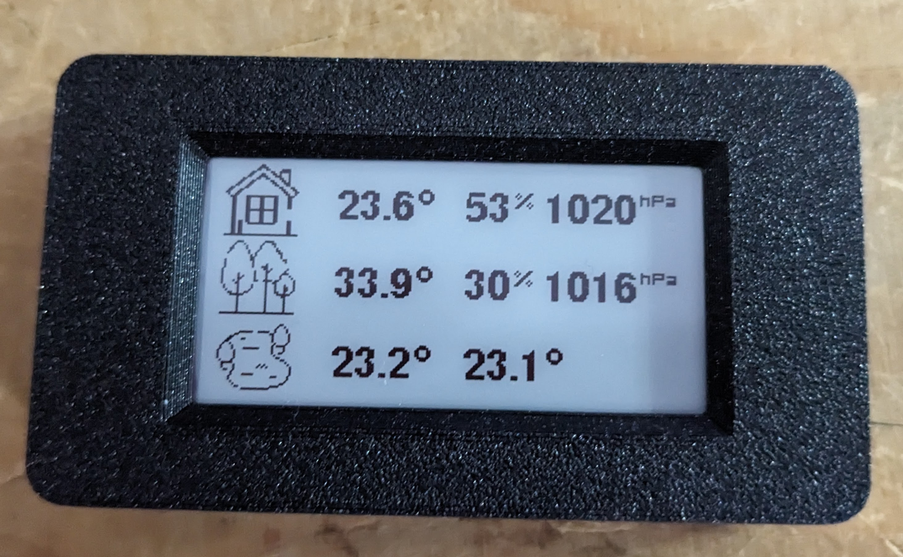

# weather-branna-inkplate2

IOT weather display for Ecowitt devices using Inkpad2

    Ecowitt sources (WN36 array, WN34 temperature sensors) --> sinks (e.g. Ecowitt console WS3900, gateway GW1100)
        sinks --> ecowitt2mqtt (running on a local device as 'weather.local')
                  ecowitt2mqtt (as mqtt publisher) --> mosquitto (localhost)
                  mosquitto (localhost) --> node express app (as mqtt subscriber)

    Inkplate2 Arduino -->
        wake up every N minutes
        connect to WLAN as defined
        request JSON updated variables from node express app
        render variables into epaper display
        go back to deep sleep

In this case, local device is a Raspberry Pi Zero (32 bit) running DietPI, with an Ethernet HAT. Zero and GW1100
are both mounted outside in an IP67 case and powered by PoE.

## display

Inkplate2

## station

Raspbery Pi Zero (with DietPI)
Waveshave Ethernet/USB Hat
Generic 10/100 POE splitter
USBA splitter + USBA to Micro-USB
IP67 box
Ethernet cable

Please make sure to isolate the cable on entry to your property, and preferably use shielded cable and ground the shielding.

[!Station](images/station.jpg)

