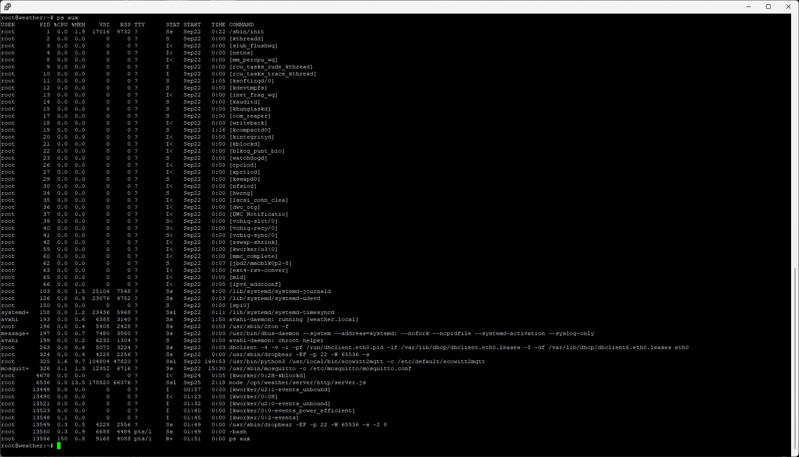
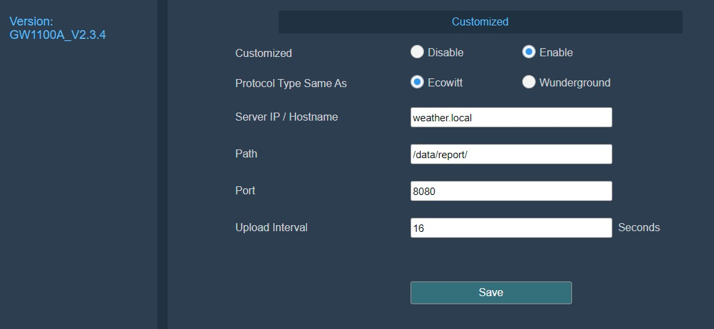

# weather-ecowitt-inkplate2

IOT weather display for Ecowitt devices using Inkpad2.

    SERVER
    
    Ecowitt sources (e.g. WN36 array, WN34 temp sensors)
        measure weather variables and send via. rf 866 mhz (OTA up to 100m) to Ecowitt sinks
    Ecowitt sinks (e.g. WS3900 console, GW1100 gateway)
        package variables and send in Ecowitt format using http (Wifi network) to ecowitt2mqtt.py (on server)
    ecowitt2mqtt.py (on server)
        transforms and sends variables (as JSON) using mqtt publish (localhost) to mosquitto (on server, as mqtt broker)
    mosquitto (on server)
        acts as mqtt broker for ecowitt2mqtt.py, nodejs app, and any other clients
    nodejs app w/ express (on server)
        receive and cache variables (as JSON) using mqtt subscribe (localhost) from mosquitto (on server, as mqtt broker)
        respond to http request (WiFi network) with cached variables (as JSON) to clients (e.g. Inkplate2)
        provide human readable (live refreshed) web interface for cached variables

    CLIENT
    
    Inkplate2 (Arduino ESP32 w/ WiFi, battery and case) -->
        wake up from deep sleep every N=5 minutes
        connect to WLAN
        request variables (as JSON), served by nodejs app
        render selected variables into epaper display
        deep sleep w/ wake up alarm

In this case, the server components (ecowitt2mqtt, mosquitto, nodejs) are housed on a Raspberry Pi Zero (32 bit)
running DietPI with an Ethernet HAT, paired with a Ecowitt GW1100 as a sink, both of which are mounted outside
(for proximity to sensors in a lake) in an IP67 case and powered by PoE. There are two other sinks (WS3900 consoles)
inside separate houses that are also delivering to the server.

## display (hardware)

This is a really simple Arduino ESP32 based e-paper device with built in battery and WiFi (b/g/n) housed in a 3d printed
case. The 2.13" screen resolution is 212 (width) x 104 (height) at 111 dpi supporting three colours: white, 
red and black. The USB-C port is for charging and communications. The provided battery is 600maAh.

    Inkplate2 (with case & battery) -- https://soldered.com/product/inkplate-2

## station (hardware: server + gateway)

    Raspbery Pi Zero H (WiFi version not needed) -- https://www.aliexpress.com/item/1005007064834607.html
    Waveshave Ethernet/USB Hat -- https://www.aliexpress.com/item/4000022488083.html
    MicroSD card (4GB minimum, I'm using 16GB) -- https://www.amazon.co.uk/dp/B07DVG12SF
    Ecowitt Gateway GW1100 (WiFi only) -- https://www.aliexpress.com/item/1005005264135330.html
    Generic 10/100 POE splitter --  https://www.aliexpress.com/item/1005004230399849.html
    USBA splitter (for POE splitter to both Zero and Gateway) -- https://www.aliexpress.com/item/1005006147721647.html
    USBA to Micro-USB (to power the Zero)
    IP67 box 200x120x75 (for external mounting) -- https://www.aliexpress.com/item/1005005367221276.html

If you use an external PoE cable, make sure to isolate the Ethernet cable on entry to your property,
and preferably use shielded cable and ground the shielding. Do not ground these to your electricity supply
ground, but ground directly to earth bonding.

## server (software)

    DietPI (as base system) -- https://dietpi.com
    ecowitt2mqtt -- https://github.com/bachya/ecowitt2mqtt
    mosquitto (for MQTT broker) -- https://github.com/eclipse/mosquitto
    avahi (for multicast DNS) -- https://avahi.org
    http-server (nodejs + express) -- https://nodejs.org
    upnp update scripts
    ddns update scripts (if required)

Sources: https://github.com/matthewgream/weather/tree/main/server

Install DietPI then the software components including systemd service scripts and defaults. The system is minimal
and all processes, including server components, run as root. The MQTT broker is not password protected. The server publishes itself 
as 'weather.local' using mDNS via. avahi. UPnP is used to configure an inbound sshd gateway and No-IP for DDNS. Configure sshd as public
key authentication only -- no password. The Ecowitt sinks must to be configured as per ecowitt2mqtt instructions. The sinks can still
publish to other services including Ecowitt itself.

## client (software)

    Arduino IDE -- https://www.arduino.cc/en/software
    ArduinoJson library -- https://arduinojson.org
    Inkplate2 library -- https://github.com/SolderedElectronics/Inkplate-Arduino-library

Sources: https://github.com/matthewgream/weather/tree/main/client/Arduino

The client software builds under Arduino IDE and is simple in execution as below. Note the intent to minimise wifi enablement time
and power on time to conserve battery, and to only refresh display if network update succeeds. Initial testing with a 5 minute
update interval resulted in a life of 6 days and 17 hours (161 hours, 9687 minutes) before the battery was exhausted.
The standard Inkplate library has been included and stripped down to remove unneeded modules (e.g. JPG, PNG and BMP
images, and colour dithering), but the code will build against the standard library. The files Secrets.hpp (in the Arduino project
folder) and secrets.txt (in the server config files) have been suppressed from the repository for obvious reasons.

