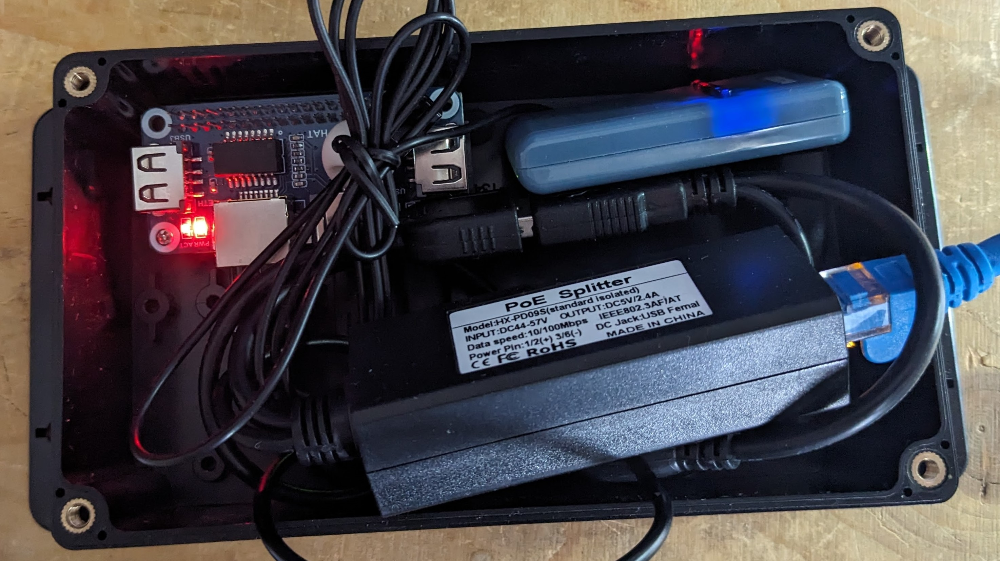

# weather-ecowitt-inkplate2

IOT weather display for Ecowitt devices using Inkpad2

    Ecowitt sources (WN36 array, WN34 temperature sensors) --> sinks (e.g. Ecowitt console WS3900, gateway GW1100)
        sinks --> ecowitt2mqtt (running on a local device as 'weather.local')
                  ecowitt2mqtt (as mqtt publisher) --> mosquitto (localhost)
                  mosquitto (localhost) --> node express app (as mqtt subscriber)

    Inkplate2 Arduino -->
        wake up every N minutes
        connect to WLAN as defined
        request JSON updated variables from node express app
        render variables into epaper display
        go back to deep sleep

In this case, local device is a Raspberry Pi Zero (32 bit) running DietPI, with an Ethernet HAT. Zero and GW1100
are both mounted outside in an IP67 case and powered by PoE.

## display

    Inkplate2 (with case & battery)

    https://soldered.com/product/inkplate-2/

## station

    Raspbery Pi Zero (with DietPI installation), no WiFi needed
    Waveshave Ethernet/USB Hat
    Ecowitt Gateway GW1100 (unfortunately WiFi only)
    Generic 10/100 POE splitter
    USBA splitter (for POE splitter o power both Zero and Gateway)
    USBA to Micro-USB (to power the Zero)
    IP67 box 200x120x75 (in this case, mounted about 4 metres above ground)

    https://www.aliexpress.com/item/1005007064834607.html
    https://www.aliexpress.com/item/4000022488083.html
    https://www.aliexpress.com/item/1005005264135330.html
    https://www.aliexpress.com/item/1005004230399849.html
    https://www.aliexpress.com/item/1005006147721647.html
    https://www.aliexpress.com/item/1005005367221276.html

Please make sure to isolate the Ethernet cable on entry to your property, and preferably use shielded cable and ground the shielding.
Do not ground these to your electricity supply ground, but ground directly to earth bonding.

## server

    DietPI (as base system)
    ecowitt2mqtt
    mosquitto (for MQTT broker)
    avahi (for multicast DNS)
    http-server (nodejs + express)
    noip update scripts
    ddns update scripts

    https://dietpi.com
    https://github.com/bachya/ecowitt2mqtt
    https://github.com/eclipse/mosquitto
    https://avahi.org
    https://nodejs.org
    
You need to install DietPI, then the software components including systemd service scripts and defaults. The system is minimal
and all processes, including server components, run as root. The MQTT broker is not password protected. The server publishes itself 
as 'weather.local' using avahi. UPNP to establish an inbound sshd gateway and NOIP provides DDNS. You should ensure sshd is public
key authentication only. The Ecowitt sinks need to be configured as per Ecowitt2MQTT instructions. You can still publish to other
services including Ecowitt itself.

## client

    Arduino IDE
    ArduinoJson
    Inkplate2
    
    https://www.arduino.cc/en/software
    
The client software builds under Arduino IDE and is simple in execution:

